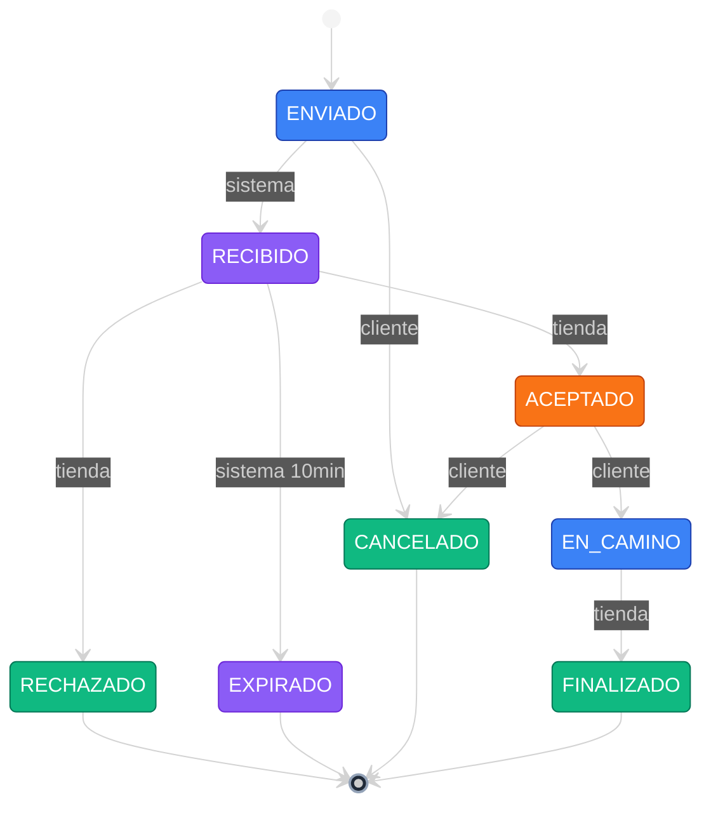

---

### 🎖️ Badges principales


### 🏷️ Stack


---

## 📸 Hero


_Landing con el claim del producto, CTA dual (**Registrá tu tienda** / **Ver quién está activo**) y un mini-mapa en vivo como preview del flujo real: pines naranjas de tiendas activas, pin azul del usuario y la lista dinámica de cercanas debajo._

---

## 📋 Tabla de contenidos

| 🛍️ Producto                                         | 🛠️ Ingeniería                                    |
| ---------------------------------------------------- | ------------------------------------------------- |
| [Qué es Ambulante](#-qué-es-ambulante)               | [Stack técnico](#️-stack-técnico)                 |
| [Features por rol](#-features-por-rol)               | [Arquitectura](#-arquitectura)                    |
| [Galería de pantallas](#-galería-de-pantallas)       | [Desarrollo con IA](#-desarrollo-con-ia)          |
| [Invariantes de dominio](#-invariantes-de-dominio)   | [Comandos](#-comandos)                            |
| [Roadmap](#️-roadmap)                                | [Gotchas](#️-gotchas)                             |

---

## 🌮 Qué es Ambulante

> [!NOTE]
> **Ambulante** es una PWA que conecta clientes con tiendas ambulantes (food trucks, puestos callejeros, vendedores móviles) mediante geolocalización en tiempo real.

> [!IMPORTANT]
> **No es un marketplace transaccional.** No procesa pagos, no gestiona stock, no tiene ratings ni chat. Solo coordina la **intención de compra** para facilitar el encuentro físico entre oferta y demanda.

| 👤 Para el cliente                                   | 🚚 Para la tienda                               |
| ---------------------------------------------------- | ----------------------------------------------- |
| Ver qué tiendas están operando **ahora mismo** cerca | Anticipar demanda sin exponer su ubicación      |
| Filtrar por radio, categoría y disponibilidad real   | Aceptar o rechazar pedidos con un tap           |
| Enviar intención de compra sin pagar por adelantado  | Recibir pedidos mientras se mueve por la ciudad |
| Seguir el estado del pedido en tiempo real           | Protección: nunca ve pedidos de otra tienda     |

---

## ✨ Features por rol

### 👤 Cliente

| Icono | Feature                   | Descripción                                     | Estado |
| :---: | ------------------------- | ----------------------------------------------- | :----: |
| 🗺️    | **Mapa en vivo**          | Pines animados con auto-recentrado              | ✅     |
| 📍    | **Geolocalización**       | Permisos graceful + fallback si se deniega      | ✅     |
| 🎯    | **Filtros por radio**     | 500m · 1km · 3km · 5km                          | ✅     |
| 📋    | **Bottom sheet cercanas** | Listado por distancia con tarjetas              | ✅     |
| 🛒    | **Flujo de pedido**       | Snapshot de producto al enviar                  | 🚧     |
| 🔔    | **Push notifications**    | Cambios de estado en tiempo real                | 📋     |

### 🚚 Tienda

| Icono | Feature                    | Descripción                              | Estado |
| :---: | -------------------------- | ---------------------------------------- | :----: |
| 📡    | **Broadcasting ubicación** | Cada 30–60s mientras está activa         | 📋     |
| 📥    | **Inbox de pedidos**       | Con máquina de estados clara             | 📋     |
| 🔒    | **Privacidad del cliente** | Ubicación exacta solo tras aceptar       | 📋     |
| 📊    | **Dashboard de actividad** | Métricas del día                         | 📋     |
| ⏱️    | **Auto-cierre**            | Pedidos inactivos se cierran a las 2h    | 📋     |

### 🛠️ Admin

| Icono | Feature                      | Descripción                          | Estado |
| :---: | ---------------------------- | ------------------------------------ | :----: |
| 🏪    | **Gestión de tiendas**       | Alta, baja, modificación             | 📋     |
| 🗂️    | **Catálogo de categorías**   | Taxonomía del producto               | 📋     |
| 🚨    | **Moderación**               | Reportes y acciones                  | 📋     |
| 📈    | **Métricas operativas**      | Dashboard agregado                   | 📋     |
| 🔐    | **Control de roles**         | Aislamiento cliente/tienda/admin     | 📋     |

**Leyenda:** ✅ implementado · 🚧 en progreso · 📋 planeado

---

## 🖼️ Galería de pantallas

> [!NOTE]
> Las siguientes son maquetas del frontend. Reemplazar con capturas reales cuando cada flujo esté cerrado.

| 🗺️ Mapa de tiendas cercanas | 🛒 Flujo de pedido |
| :-: | :-: |
|  |  |
| _Landing hero con mini-mapa en vivo, pines de tiendas activas y lista de cercanas_ | _Snapshot del producto y seguimiento de estado (placeholder)_ |

| 🚚 Dashboard de tienda | 🔔 Push notifications |
| :-: | :-: |
|  |  |
| _Inbox de pedidos con máquina de estados_ | _Notificaciones de aceptación y cambios_ |

---

## 🧩 Invariantes de dominio

> [!WARNING]
> Estas son reglas no negociables del producto. Modificarlas requiere actualizar primero [`docs/PRD.md`](./docs/PRD.md) — ver [`CLAUDE.md §7`](./CLAUDE.md).



- 🔒 La ubicación exacta del cliente **nunca** se expone antes de `ACEPTADO`
- 👮 Solo el actor autorizado dispara cada transición
- 🧊 Estados terminales son inmutables
- ⏰ Sin respuesta en 10 min → `EXPIRADO` automático
- 🕑 Aceptado sin cierre en 2h → auto-cierre

---

## 🛠️ Stack técnico

### 🟢 Actual (hoy en el repo)

| Capa             | Tecnología                | Versión    | Estado |
| ---------------- | ------------------------- | ---------- | :----: |
| Framework        | Next.js App Router        | `14.2`     | ✅     |
| UI               | React                     | `18.3`     | ✅     |
| Lenguaje         | TypeScript strict         | `5.5`      | ✅     |
| Estilos          | Tailwind CSS              | `3.4`      | ✅     |
| Componentes      | shadcn/ui + Radix         | —          | ✅     |
| Iconos           | lucide-react              | `0.441`    | ✅     |

### 🎯 Objetivo (se migra por ventanas)

| Capa             | Tecnología                                              | Estado |
| ---------------- | ------------------------------------------------------- | :----: |
| Framework        | **Next.js 15** App Router                               | 🚧     |
| Package manager  | **pnpm**                                                | 🚧     |
| Estilos          | **Tailwind CSS v4**                                     | 🚧     |
| Animaciones      | **motion** (ex Framer Motion)                           | 📋     |
| Formularios      | **react-hook-form** + **zod**                           | 📋     |
| Data fetching    | **@tanstack/react-query** v5                            | 📋     |
| Estado global    | **zustand**                                             | 📋     |
| URL state        | **nuqs**                                                | 📋     |
| Mapas            | **react-map-gl** + **MapLibre GL JS** (sin API key)     | 📋     |
| PWA              | **serwist** + Web Push nativo                           | 📋     |
| Unit testing     | **Vitest** + Testing Library                            | 📋     |
| E2E testing      | **Playwright** (cobertura mínima 80%)                   | 📋     |
| Deploy           | **Vercel**                                              | 🚧     |
| Backend (futuro) | **Supabase** (Postgres + Auth + Realtime + PostGIS)     | 📋     |

**Leyenda:** ✅ instalado · 🚧 parcial / en progreso · 📋 planeado

> [!TIP]
> Mientras no hay backend, los servicios de datos se mockean en `shared/services/` detrás de interfaces claras para que el swap a Supabase sea trivial.

---

## 📂 Arquitectura

> **Filosofía:** todo lo reutilizable vive en `shared/`. Las features son islas independientes.

```
ambulante/
├── 📱 app/                     Next.js App Router (rutas, layouts)
│   ├── (client)/               👤 Rol Cliente (mapa, pedidos)
│   ├── (store)/                🚚 Rol Tienda (dashboard)
│   └── (admin)/                🛠️  Rol Administrador
│
├── 🧩 features/                Una carpeta por feature, totalmente aislada
│   └── <feature>/
│       ├── components/         Smart (container) + Dumb (presentational)
│       ├── hooks/
│       ├── services/
│       └── types/
│
├── ♻️  shared/                 Todo lo REUTILIZABLE (usado en 2+ lugares)
│   ├── components/ui/          Primitivas shadcn
│   ├── hooks/                  useGeolocation, useDebounce, …
│   ├── services/               Clientes de datos (hoy mocks, mañana Supabase)
│   └── REGISTRY.md             🔑 Índice vivo de lo reutilizable
│
└── 📚 docs/
    └── PRD.md                  Fuente de verdad del producto
```

> [!CAUTION]
> **Regla de oro:** borrar una feature nunca debe romper otras. Si dos features necesitan lo mismo, va a `shared/` y se documenta en [`shared/REGISTRY.md`](./shared/REGISTRY.md) **en el mismo commit**.

<details>
<summary><b>🧱 Ver ejemplo de un componente Container / Presentational</b></summary>

```tsx
// features/map/components/StoreCard/StoreCard.tsx  (Dumb)
interface StoreCardProps {
  readonly name: string;
  readonly distanceMeters: number;
  readonly onSelect: () => void;
}

export function StoreCard({ name, distanceMeters, onSelect }: StoreCardProps) {
  return (
    <button onClick={onSelect} className="rounded-lg border p-3 text-left">
      <h3 className="font-semibold">{name}</h3>
      <p className="text-sm text-muted-foreground">{distanceMeters} m</p>
    </button>
  );
}
```

```tsx
// features/map/components/StoreCard/StoreCard.container.tsx  (Smart)
"use client";
import { useNearbyStores } from "@/features/map/hooks/useNearbyStores";
import { StoreCard } from "./StoreCard";

export function StoreCardContainer({ storeId }: { readonly storeId: string }) {
  const { data, isLoading } = useNearbyStores();
  const store = data?.find((s) => s.id === storeId);
  if (isLoading || !store) return null;
  return (
    <StoreCard
      name={store.name}
      distanceMeters={store.distanceMeters}
      onSelect={() => store.select()}
    />
  );
}
```

</details>

---

## 🤖 Desarrollo con IA


> [!IMPORTANT]
> Este repo está **diseñado desde cero para colaborar con agentes de IA** (Claude Code como primario). La mayor parte del código se escribe en un loop humano↔agente con reglas y contexto explícitos.

### 📜 El contrato con el agente

[`CLAUDE.md`](./CLAUDE.md) es la **fuente de verdad operativa** para cualquier agente o humano que toca el repo.

| 🧱 Arquitectura & stack           | ⚖️ Reglas de código invariantes           |
| --------------------------------- | ----------------------------------------- |
| Versiones objetivo                | TypeScript strict, prohibido `any`        |
| Reglas de promoción a `shared/`   | Sin magic strings / numbers               |
| Convenciones de carpetas y naming | Patrón Container / Presentational         |
| Barrel exports por feature        | Máx. 200 líneas por componente            |
| Alias absolutos `@/`              | Máx. 300 líneas por archivo               |
| Server Components por default     | Inmutabilidad obligatoria                 |

| 🧩 Invariantes de dominio         | 🔄 Flujo de trabajo esperado              |
| --------------------------------- | ----------------------------------------- |
| Máquina de estados del pedido     | 1. Leer `REGISTRY.md`                     |
| Privacidad de ubicación           | 2. Validar scope contra PRD               |
| Roles aislados                    | 3. Diseñar tipos con Zod primero          |
| Timeouts de negocio               | 4. TDD (RED → GREEN → REFACTOR)           |
| Snapshot de productos             | 5. Lint + typecheck                       |
| Validación en boundaries con Zod  | 6. Commit con conventional commits        |

### 📚 El registry reutilizable

[`shared/REGISTRY.md`](./shared/REGISTRY.md) es un **índice vivo** de componentes, hooks, utils y services reutilizables. Antes de crear algo nuevo, el agente consulta el registry para evitar duplicación. Si agrega algo a `shared/`, lo registra en el **mismo commit**.

### 🦾 Skills y agentes configurados

| Skill                          | Ubicación                                      | Propósito                           |
| ------------------------------ | ---------------------------------------------- | ----------------------------------- |
| `next-best-practices`          | `.agents/skills/next-best-practices/`          | Patrones Next.js 15                 |
| `shadcn`                       | `.agents/skills/shadcn/`                       | Composición de componentes shadcn   |
| `vercel-react-best-practices`  | `.agents/skills/vercel-react-best-practices/`  | Optimización React/Next             |
| Skills del proyecto            | `.claude/skills/`                              | Específicas del dominio Ambulante   |

### 🔄 Flujo por feature


1. **🔍 Research & Reuse** — `shared/REGISTRY.md` + prior art en GitHub antes de escribir nada
2. **📋 Plan First** — plan, riesgos y fases antes de tocar código
3. **🏗️ Type-first** — Zod schema → TS type antes de implementación
4. **🧪 TDD** — test falla (RED) → mínimo para pasar (GREEN) → refactor
5. **👀 Code review automático** — agente revisa diff antes del commit
6. **✅ Commit** — conventional commits, PR con test plan

### 💡 Por qué este approach

| 🎯 Contexto explícito > implícito                    | 🤖 Reglas ejecutables por máquina                       |
| ---------------------------------------------------- | ------------------------------------------------------- |
| Las invariantes del PRD están escritas, no asumidas. | "Máx 200 líneas" es verificable. "Código limpio" no.    |

| 🏝️ Features como islas                                        | 🎭 Mocks con interfaces                                        |
| ------------------------------------------------------------- | -------------------------------------------------------------- |
| El agente trabaja en una feature sin cargar todo el repo.     | Frontend completo antes del backend, sin acoplar temporal.     |

---

## 🏃 Comandos

| Comando                                      | Descripción                     |
| --------------------------------------------- | ------------------------------- |
| <kbd>pnpm dev</kbd>                          | 🚀 Servidor de desarrollo       |
| <kbd>pnpm build</kbd>                        | 📦 Build de producción          |
| <kbd>pnpm start</kbd>                        | ▶️ Servir build                 |
| <kbd>pnpm lint</kbd>                         | 🔍 ESLint                       |
| <kbd>pnpm typecheck</kbd>                    | ✓ `tsc --noEmit`                |
| <kbd>pnpm test</kbd>                         | 🧪 Vitest                       |
| <kbd>pnpm test:e2e</kbd>                     | 🎭 Playwright                   |

**Shortcuts útiles en desarrollo**

- <kbd>⌘</kbd> + <kbd>K</kbd> · Command menu (cuando esté implementado)
- <kbd>⌘</kbd> + <kbd>Shift</kbd> + <kbd>P</kbd> · Chrome DevTools → Sensors → mockear Location
- <kbd>F12</kbd> · Abrir DevTools para inspeccionar el service worker

> [!WARNING]
> El repo todavía usa `package-lock.json`. La migración a `pnpm` está pendiente.

---

## 🗺️ Roadmap

### Fase 1 — Cliente core _(en progreso)_

- [x] Landing page con mini-mapa en vivo
- [x] Mapa de cliente con geolocalización
- [x] Filtros por radio
- [x] Bottom sheet de tiendas cercanas
- [ ] Flujo de intención de compra
- [ ] Snapshot de productos

### Fase 2 — Tienda

- [ ] Dashboard de tienda
- [ ] Broadcasting de ubicación
- [ ] Inbox de pedidos
- [ ] Máquina de estados implementada

### Fase 3 — Backend

- [ ] Integración Supabase (Auth + Postgres + Realtime)
- [ ] Migración de mocks a servicios reales
- [ ] PostGIS para queries geoespaciales

### Fase 4 — PWA production-ready

- [ ] Service worker con serwist
- [ ] Push notifications
- [ ] Instalación iOS/Android
- [ ] Offline básico

### Fase 5 — Admin

- [ ] Panel de administración
- [ ] Moderación
- [ ] Métricas operativas

---

## ⚠️ Gotchas

> [!CAUTION]
> **iOS Safari + Push notifications:** solo funciona si el usuario instaló la PWA. Fallback a polling para no-instalados.

> [!WARNING]
> **Geolocalización en dev:** usá Chrome DevTools (<kbd>Sensors</kbd> → <kbd>Location</kbd>) en lugar de hardcodear coordenadas.

> [!TIP]
> **Service Worker:** solo corre en build de producción. Para testearlo: <kbd>pnpm build</kbd> + <kbd>pnpm start</kbd>.

> [!NOTE]
> **Mocks:** no importar mocks directamente en componentes; van detrás de las interfaces de `shared/services/`.

---

## 📜 Estado del proyecto


**Solo frontend, datos mockeados, sin backend todavía.** El foco actual es cerrar los flujos de Cliente (mapa, búsqueda, intención de compra) antes de integrar Supabase.

---


