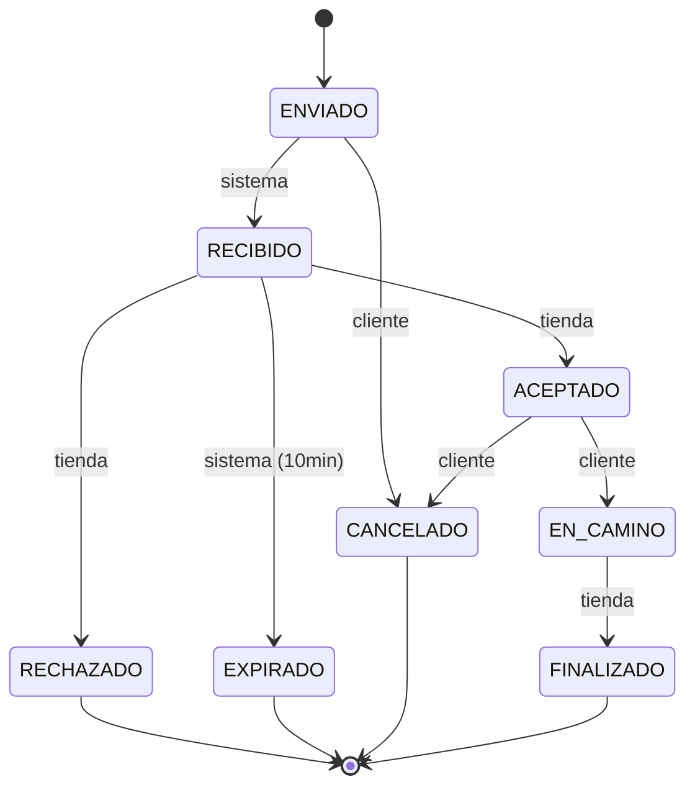

**🗺️ Mapa en vivo**  ·  **📡 Geolocalización en tiempo real**  ·  **🛒 Intención de compra sin pago**  ·  **🔒 Privacidad por diseño**

## 🌮 Qué es Ambulante

> Una **PWA** que conecta clientes con tiendas ambulantes —food trucks, puestos callejeros, vendedores móviles— mediante geolocalización en tiempo real.

**No es un marketplace transaccional.** No procesa pagos, no gestiona stock, no tiene ratings ni chat. Solo coordina la **intención de compra** para facilitar el encuentro físico entre oferta y demanda.


| 👤 Para el cliente                                   | 🚚 Para la tienda                               |
| ---------------------------------------------------- | ----------------------------------------------- |
| Ver qué tiendas están operando **ahora mismo** cerca | Anticipar demanda sin exponer su ubicación      |
| Filtrar por radio, categoría y disponibilidad real   | Aceptar o rechazar pedidos con un tap           |
| Enviar intención de compra sin pagar por adelantado  | Recibir pedidos mientras se mueve por la ciudad |
| Seguir el estado del pedido en tiempo real           | Protección: nunca ve pedidos de otra tienda     |


## ✨ Features


|     |
| --- |
|     |


### 👤 Cliente

- 🗺️ **Mapa en vivo** con pines animados
- 📍 **Geolocalización** con fallback graceful
- 🎯 **Filtros por radio** (500m → 5km)
- 📋 **Bottom sheet** con listado por distancia
- 🛒 **Flujo de pedido** con snapshot de producto
- 🔔 **Push notifications** de cambios de estado

### 🚚 Tienda

- 📡 **Broadcasting** de ubicación cada 30–60s
- 📥 **Inbox** de pedidos entrantes
- ✅ **Máquina de estados** clara
- 🔒 **Privacidad del cliente** hasta aceptar
- 📊 **Dashboard** de actividad
- ⏱️ **Auto-cierre** de pedidos inactivos

### 🛠️ Admin

- 🏪 Gestión de tiendas
- 🗂️ Catálogo de categorías
- 🚨 Moderación
- 📈 Métricas operativas
- 🔐 Control de roles aislados

### 🎨 Producto & UX


| 📱 PWA instalable     | ⚡ Landing animada | 🌗 Dark mode | 🇦🇷 UI en español |
| --------------------- | ----------------- | ------------ | ------------------ |
| Offline básico + push | Mini-mapa en vivo | Nativo       | Código en inglés   |


## 🧩 Invariantes de dominio

> Reglas no negociables del producto — ver `[CLAUDE.md §7](./CLAUDE.md)`




- 🔒 La ubicación exacta del cliente **nunca** se expone antes de `ACEPTADO`
- 👮 Solo el actor autorizado dispara cada transición
- 🧊 Estados terminales son inmutables
- ⏰ Sin respuesta en 10 min → `EXPIRADO` automático
- 🕑 Aceptado sin cierre en 2h → auto-cierre

## 🛠️ Stack técnico

**🟢 Actual (lo que hay en el repo hoy)**  

Next.js
React
TypeScript
Tailwind
shadcn/ui
Radix

**🎯 Objetivo (definido en CLAUDE.md, se migra por ventanas)**  


| Área             | Tecnología                                                       | Estado |
| ---------------- | ---------------------------------------------------------------- | ------ |
| Framework        | **Next.js 15** App Router                                        | 🟡     |
| Package manager  | **pnpm**                                                         | 🟡     |
| Estilos          | **Tailwind CSS v4**                                              | 🟡     |
| Animaciones      | **motion** (ex Framer Motion)                                    | 🔴     |
| Formularios      | **react-hook-form** + **zod**                                    | 🔴     |
| Data fetching    | **@tanstack/react-query** v5                                     | 🔴     |
| Estado global    | **zustand**                                                      | 🔴     |
| URL state        | **nuqs**                                                         | 🔴     |
| Mapas            | **react-map-gl** + **MapLibre GL JS** (open source, sin API key) | 🔴     |
| PWA              | **serwist** + Web Push nativo                                    | 🔴     |
| Unit testing     | **Vitest** + Testing Library                                     | 🔴     |
| E2E testing      | **Playwright** (cobertura mínima 80%)                            | 🔴     |
| Deploy           | **Vercel**                                                       | 🟡     |
| Backend (futuro) | **Supabase** (Postgres + Auth + Realtime + PostGIS)              | 🔴     |


> 🟢 instalado · 🟡 parcial · 🔴 pendiente

Mientras no hay backend, los servicios de datos se **mockean en `shared/services/`** detrás de interfaces claras para que el swap a Supabase sea trivial.

## 📂 Arquitectura

> **Filosofía:** todo lo reutilizable vive en `shared/`. Las features son islas independientes.

**🗂️ Estructura de carpetas**  

```
ambulante/
├── 📱 app/                     Next.js App Router (rutas, layouts)
│   ├── (client)/               👤 Rol Cliente (mapa, pedidos)
│   ├── (store)/                🚚 Rol Tienda (dashboard)
│   └── (admin)/                🛠️  Rol Administrador
│
├── 🧩 features/                Una carpeta por feature, totalmente aislada
│   └── <feature>/
│       ├── components/         Smart (container) + Dumb (presentational)
│       ├── hooks/
│       ├── services/
│       └── types/
│
├── ♻️  shared/                 Todo lo REUTILIZABLE (usado en 2+ lugares)
│   ├── components/ui/          Primitivas shadcn
│   ├── hooks/                  useGeolocation, useDebounce, …
│   ├── services/               Clientes de datos (hoy mocks, mañana Supabase)
│   └── REGISTRY.md             🔑 Índice vivo de lo reutilizable
│
└── 📚 docs/
    └── PRD.md                  Fuente de verdad del producto
```

> **💎 Regla de oro:** borrar una feature nunca debe romper otras. Si dos features necesitan lo mismo, va a `shared/` y se documenta en `shared/REGISTRY.md` **en el mismo commit**.

# 🤖 Desarrollo con IA

Este repo está **diseñado desde cero para colaborar con agentes de IA** (Claude Code como primario). La mayor parte del código se escribe en un loop humano↔agente con reglas y contexto explícitos.

### 📜 El contrato con el agente

`[CLAUDE.md](./CLAUDE.md)` es la **fuente de verdad operativa** para cualquier agente o humano que toca el repo:


|     |
| --- |
|     |


**🧱 Arquitectura & stack**

- Versiones objetivo
- Reglas de promoción a `shared/`
- Convenciones de carpetas y naming

**⚖️ Reglas de código invariantes**

- TypeScript strict, prohibido `any`
- Sin magic strings / numbers
- Patrón Container / Presentational
- Máx. 200 líneas por componente
- Máx. 300 líneas por archivo
- Inmutabilidad obligatoria

**🧩 Invariantes de dominio**

- Máquina de estados del pedido
- Privacidad de ubicación
- Roles aislados
- Timeouts de negocio
- Snapshot de productos

**🔄 Flujo de trabajo esperado**

1. Leer `REGISTRY.md`
2. Validar scope contra PRD
3. Diseñar tipos con Zod primero
4. TDD (RED → GREEN → REFACTOR)
5. Lint + typecheck
6. Commit con conventional commits

### 📚 El registry reutilizable

`[shared/REGISTRY.md](./shared/REGISTRY.md)` es un **índice vivo** de componentes, hooks, utils y services reutilizables. Antes de crear algo nuevo, el agente debe consultarlo para evitar duplicación. Si agrega algo a `shared/`, lo registra en el **mismo commit**.

### 🦾 Skills y agentes configurados

```
📦 .agents/skills/                     📦 .claude/skills/
├── 🟢 next-best-practices            └── 🎯 Skills específicas del proyecto
├── 🎨 shadcn
└── ⚛️  vercel-react-best-practices
```

### 🔄 Flujo por feature


1. **🔍 Research & Reuse** — `shared/REGISTRY.md` + prior art en GitHub antes de escribir nada
2. **📋 Plan First** — plan, riesgos y fases antes de tocar código
3. **🏗️ Type-first** — Zod schema → TS type antes de implementación
4. **🧪 TDD** — test falla (RED) → mínimo para pasar (GREEN) → refactor
5. **👀 Code review automático** — agente revisa diff antes del commit
6. **✅ Commit** — conventional commits, PR con test plan

### 💡 Por qué este approach


|     |
| --- |
|     |


**🎯 Contexto explícito > implícito**
Las invariantes del PRD están escritas, no asumidas.

**🤖 Reglas ejecutables por máquina**
"Máx 200 líneas por componente" es verificable. "Código limpio" no.

**🏝️ Features como islas**
El agente trabaja en una feature sin cargar todo el repo en contexto.

**🎭 Mocks con interfaces**
Frontend completo antes del backend, sin acoplar a implementaciones temporales.

## 🏃 Comandos

```bash
pnpm dev         # 🚀 dev server
pnpm build       # 📦 build de producción
pnpm start       # ▶️  servir build
pnpm lint        # 🔍 ESLint
pnpm typecheck   # ✓  tsc --noEmit
pnpm test        # 🧪 vitest
pnpm test:e2e    # 🎭 playwright
```

> ⚠️ El repo todavía usa `package-lock.json`; la migración a `pnpm` está pendiente.

## ⚠️ Gotchas

**🍎 iOS Safari + Push notifications**  
Solo funciona si el usuario instaló la PWA. Fallback a polling para no-instalados.

**📍 Geolocalización en dev**  
Usá Chrome DevTools (`Sensors → Location`) en lugar de hardcodear coordenadas.

**⚙️ Service Worker**  
Solo corre en build de producción. Para testearlo: `pnpm build && pnpm start`.

**🎭 Mocks de servicios**  
No importar mocks directamente en componentes; van detrás de las interfaces de `shared/services/`.

## 📜 Estado del proyecto

Pre-MVP
Frontend only
Mocked data

**Solo frontend, datos mockeados, sin backend todavía.** El foco actual es cerrar los flujos de Cliente (mapa, búsqueda, intención de compra) antes de integrar Supabase.